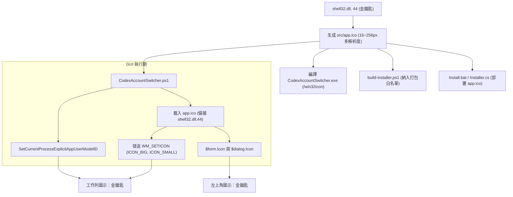

# 實作計畫：視窗圖示與工作列圖示一致性修正

## 1. 問題概述
目前「Codex 與 Antigravity 帳號切換工具」在桌面與開始功能表的捷徑圖示採用 Windows 系統金鑰匙圖示（`shell32.dll, 44`）。但在執行時：
- **程式視窗左上角圖示**：顯示 Windows Forms 預設的白底藍窗圖示。
- **Windows 工作列圖示**：顯示預設處理程序圖示或 PowerShell 終端機圖示。

本計畫旨在讓應用程式於執行時，視窗左上角圖示、Windows 工作列圖示、Alt-Tab 切換圖示均與捷徑圖示（金鑰匙）保持完全一致。

---

## 2. 原因分析
1. **未設定表單 Icon 屬性**：`src/CodexAccountSwitcher.ps1` 中的主視窗 `$form` 與對話框 `$dialog` 未指定 `.Icon`，WinForms 因此採用系統預設圖示。
2. **缺乏獨立 AppUserModelID**：由於 GUI 係透過 `powershell.exe` 直譯啟動，未呼叫 Windows Shell 的 `SetCurrentProcessExplicitAppUserModelID`，導致 Windows 工作列無法正確將該視窗群組化為獨立應用程式並提取其視窗圖示。
3. **啟動器與建置流程未內嵌圖示**：`CodexAccountSwitcher.exe`（由 `Launcher.cs` 編譯）未加入 `/win32icon` 參數，因此 EXE 實體本身也是預設圖示。

---

## 3. 變更方案與架構設計

### 變更項目：
1. **生成 `src/app.ico` 原生圖示**：
   - 提取 `shell32.dll, 44` 之 16x16, 20x20, 24x24, 32x32, 40x40, 48x48, 64x64, 96x96, 128x128, 256x256 全尺寸圖標，建置為標準多解析度 `.ico` 檔案，納入版本控管。
2. **更新 `src/CodexAccountSwitcher.ps1`**：
   - 在表單啟動前呼叫 `[NativeGuiHelper]::SetCurrentProcessExplicitAppUserModelID('CodexTools.CodexAntigravitySwitcher')`。
   - 實作安全提取/載入函式：優先讀取 `app.ico`，缺漏時自動備援回退至 `shell32.dll, 44` 原生提取。
   - 主視窗 `$form` 設定 `$form.Icon`，並在視窗控制代碼建立（HandleCreated）時發送 Win32 `WM_SETICON`（大圖示與小圖示），保證工作列與 Alt-Tab 清晰呈現。
   - 自訂帳號彈出視窗（`Prompt-AccountName`）同步設定 `$dialog.Icon`。
3. **更新 `scripts/build-installer.ps1`**：
   - 白名單中加入 `app.ico`。
   - 編譯 `CodexAccountSwitcher.exe` 與安裝程式 `Setup-*.exe` 時加入 `/win32icon` 參數。
4. **更新 `src/Install.bat` 與 `src/Installer.cs`**：
   - 安裝檔案複製清單納入 `app.ico`。
   - 捷徑與登錄檔圖示位置優先指向安裝目錄的 `app.ico`（並兼顧 `shell32.dll, 44`）。
5. **部署至本機環境測試**：
   - 重新編譯啟動器與更新現有 `C:\Users\vince\AppData\Local\Programs\CodexAntigravitySwitcher` 安裝檔。

---

## 4. 驗證步驟
1. 驗證 `src/app.ico` 格式與尺寸完整性。
2. 啟動 `CodexAccountSwitcher.ps1` 進行測試：
   - 檢查主視窗左上角是否顯示金鑰匙圖示。
   - 檢查 Windows 11 工作列是否顯示獨立按鈕且圖示為金鑰匙。
   - 檢查「儲存登入帳號」子對話框左上角是否一致。
3. 測試快捷方式啟動（`CodexAccountSwitcher.exe`）：
   - 從桌面捷徑啟動，驗證工作列與左上角圖示正確無誤。
4. 執行現有自動化測試（`tests/Run-SelfTest.ps1`）確保既有功能無回歸問題。
