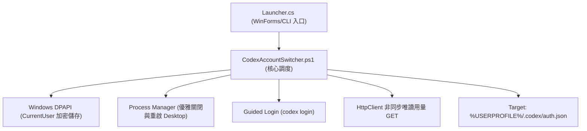

# Codex 帳號切換工具 - 系統架構與規格設計 (System Specification)

## 1. 架構目標
本工具旨在為 Windows 上的 OpenAI Codex Desktop 提供安全、高可靠、原子化且不破壞原有工作區的多帳號本機切換機制。

---

## 2. 核心架構與組件劃分

### 2.1 模組職責
1. **啟動器 (`Launcher.cs`)**：
   - 使用 .NET Framework 原生編譯為 `CodexAccountSwitcher.exe`。
   - 以 `-WindowStyle Hidden -ExecutionPolicy Bypass` 靜默拉起 PowerShell，消除黑底命令提示字元視窗。
2. **切換調度器 (`CodexAccountSwitcher.ps1`)**：
   - 負責帳號備份讀取、還原點維護、程序識別與原子覆寫。
3. **引導授權 (`Start-GuidedLogin`)**：
   - 調用 `codex login`，提示使用者複製授權網址到無痕視窗登入。
   - 不保證登入永遠有效；已撤銷的備份需重新登入。
4. **安裝精靈 (`Installer.cs`)**：
   - 自包含單檔 GUI 安裝器，負責檔案解包、桌面捷徑與開始功能表建立、Windows 應用程式清單註冊。

---

## 3. 安全規格與邊界 (Security Boundary)

| 安全領域 | 設計規範 |
| :--- | :--- |
| **憑證儲存** | 僅儲存於 `%LOCALAPPDATA%\CodexAccountSwitcher\*.bin`，採 DPAPI CurrentUser 加密。 |
| **機敏隔離** | 嚴格禁止將任何真實 Token、API Key、個人郵件納入發行包或版本控制。 |
| **原子寫入** | 憑證替換使用 `Write-Atomic`（同目錄臨時檔寫入 + Replace/Move），確保斷電不損毀。 |
| **還原機制** | 每次切換前自動產生 `last-switch.rollback`，異常時自動回滾。 |

## 4. 唯讀額度查詢

`QuotaClient.Fetch` 使用 .NET HttpClient 非同步 GET，WinForms Timer 收取已完成 Task。目標限定 `https://chatgpt.com/backend-api/wham/usage`，不跟隨重新導向、無 Cookie、3 秒逾時、回應上限 256 KiB。僅回傳狀態及成功 JSON，錯誤本文與例外內容不寫入日誌。

目前帳號使用最新登入檔，其他帳號使用現有加密備份；查詢不刷新或回寫認證。結果依帳號 Key 及查詢世代更新，重新整理、切換／登入／還原、關閉視窗取消舊請求。窗口依實際週期顯示，缺值保持未知，多額度資訊保留於列提示。

欄位與驗證方式見 [額度查詢計畫](../implementation_plan/quota_display.md)。內部端點不具穩定性保證，查詢失敗不阻擋帳號切換。
