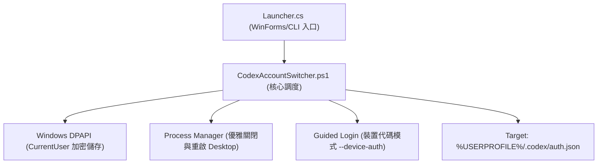

# Codex 帳號切換工具 - 系統架構與規格設計 (System Specification)

## 1. 架構目標
本工具旨在為 Windows 上的 OpenAI Codex Desktop 提供安全、高可靠、原子化且不破壞原有工作區的多帳號本機切換機制。

---

## 2. 核心架構與組件劃分

### 2.1 模組職責
1. **啟動器 (`Launcher.cs`)**：
   - 使用 .NET Framework 原生編譯為 `CodexAccountSwitcher.exe`。
   - 以 `-WindowStyle Hidden -ExecutionPolicy Bypass` 靜默拉起 PowerShell，消除黑底命令提示字元視窗。
2. **切換調度器 (`CodexAccountSwitcher.ps1`)**：
   - 負責帳號備份讀取、還原點維護、程序識別與原子覆寫。
3. **裝置代碼安全授權 (`Start-GuidedLogin`)**：
   - 調用 `codex login --device-auth` 並自動開啟 Chrome/Edge 獨立無痕視窗。
   - 解決主瀏覽器工作階段互斥導致的雲端 Refresh Token 撤銷問題。
4. **安裝精靈 (`Installer.cs`)**：
   - 自包含單檔 GUI 安裝器，負責檔案解包、桌面捷徑與開始功能表建立、Windows 應用程式清單註冊。

---

## 3. 安全規格與邊界 (Security Boundary)

| 安全領域 | 設計規範 |
| :--- | :--- |
| **憑證儲存** | 僅儲存於 `%LOCALAPPDATA%\CodexAccountSwitcher\*.bin`，採 DPAPI CurrentUser 加密。 |
| **機敏隔離** | 嚴格禁止將任何真實 Token、API Key、個人郵件納入發行包或版本控制。 |
| **原子寫入** | 憑證替換使用 `Write-Atomic`（同目錄臨時檔寫入 + Replace/Move），確保斷電不損毀。 |
| **還原機制** | 每次切換前自動產生 `last-switch.rollback`，異常時自動回滾。 |
