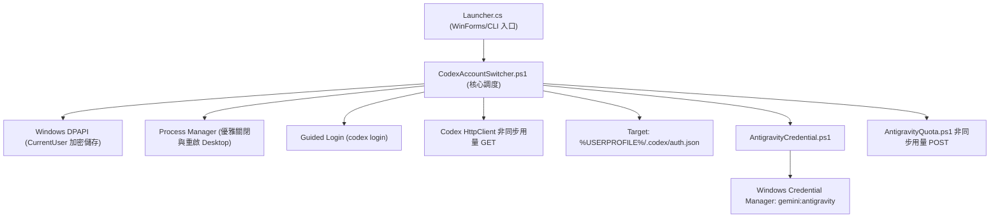

# Codex／Antigravity 帳號切換工具 - 系統架構與規格設計 (System Specification)

## 1. 架構目標
本工具在 Windows 上以 Codex 與 Antigravity 分頁提供本機帳號切換。兩個分頁只處理各自的認證；原有工作區與對話保持原位。

---

## 2. 核心架構與組件劃分

### 2.1 模組職責
1. **啟動器 (`Launcher.cs`)**：
   - 使用 .NET Framework 原生編譯為 `CodexAccountSwitcher.exe`。
   - 以 `-WindowStyle Hidden -ExecutionPolicy Bypass` 靜默拉起 PowerShell，消除黑底命令提示字元視窗。
2. **切換調度器 (`CodexAccountSwitcher.ps1`)**：
   - 負責帳號備份讀取、還原點維護、程序識別與原子覆寫。
3. **引導授權 (`Start-GuidedLogin`)**：
   - 調用 `codex login`，提示使用者複製授權網址到無痕視窗登入。
   - 不保證登入永遠有效；已撤銷的備份需重新登入。
4. **安裝精靈 (`Installer.cs`)**：
   - 自包含單檔 GUI 安裝器，負責檔案解包、桌面捷徑與開始功能表建立、Windows 應用程式清單註冊。
5. **Antigravity 認證 (`AntigravityCredential.ps1`)**：
   - 僅讀寫 Generic Credential `gemini:antigravity`，驗證 ID Token 身分並以 DPAPI 儲存各帳號備份。
   - 停止 Antigravity 2.0 桌面版後替換認證，讀回驗證；失敗時回寫切換前認證。
   - 引導新增帳號時先備份目前認證，停止桌面版、清除本機認證，再啟動官方登入；確認新身分後儲存。取消或未完成時還原原認證。
   - 不替換 `%APPDATA%\Antigravity`、`~/.gemini/antigravity` 或任何工作區、對話資料庫。
6. **Antigravity 額度 (`AntigravityQuota.ps1`)**：
   - 以已儲存帳號的存取權杖查詢 Gemini、Claude/GPT 各自的五小時與每週額度，另查詢方案。
   - 存取權杖過期時，僅在記憶體中以刷新權杖換發；OAuth 用戶端設定取自已安裝的 Antigravity 程式，不寫入原始認證或備份。

---

## 3. 安全規格與邊界 (Security Boundary)

| 安全領域 | 設計規範 |
| :--- | :--- |
| **憑證儲存** | 新版儲存於 `%LOCALAPPDATA%\CodexAntigravitySwitcher\*.bin`，採 DPAPI CurrentUser 加密；啟動時驗證並複製缺少的舊版備份，保留舊版原件且不覆寫新版同名備份。 |
| **機敏隔離** | 嚴格禁止將任何真實 Token、API Key、個人郵件納入發行包或版本控制。 |
| **原子寫入** | 憑證替換使用 `Write-Atomic`（同目錄臨時檔寫入 + Replace/Move），確保斷電不損毀。 |
| **還原機制** | 每次切換前自動產生 `last-switch.rollback`，異常時自動回滾。 |
| **Antigravity 備份** | 存於 `%LOCALAPPDATA%\CodexAntigravitySwitcher\antigravity\*.bin`；Codex 與 Antigravity 的備份及還原點分開。 |
| **Antigravity 實證邊界** | 合成認證測試及兩個真實帳號的免重登切換、引導登入已通過；版本或登入格式變更後需重驗。 |
| **獨立測試** | `-IsolatedAntigravityTestPath` 將備份及日誌放在指定目錄，停用 Codex 分頁並避免讀取既有 Codex 登入檔；Antigravity 認證目標仍為目前使用者的真實項目。 |

新版安裝目錄、捷徑與 Windows 解除安裝項目另設名稱，與既有 `CodexAccountSwitcher` 安裝並存。執行中的 Codex 視窗仍使用相同單一實例鎖，避免兩套工具同時切換同一個 `auth.json`。
新版桌面與開始功能表捷徑沿用舊版的 `shell32.dll,44` 金鑰圖示。

## 4. 唯讀額度查詢

Codex 的 `QuotaClient.Fetch` 使用 .NET HttpClient 非同步 GET，WinForms Timer 收取已完成 Task。目標限定 `https://chatgpt.com/backend-api/wham/usage`，不跟隨重新導向、無 Cookie、3 秒逾時、回應上限 256 KiB。僅回傳狀態及成功 JSON，錯誤本文與例外內容不寫入日誌。

Codex 目前帳號使用最新登入檔，其他帳號使用現有加密備份；查詢不刷新或回寫認證。Antigravity 目前帳號使用認證管理員中的登入，其他帳號使用加密備份；非同步 POST 至 Google Cloud Code 的 `retrieveUserQuotaSummary`，必要時向 Google OAuth 換發短期權杖，並以 `loadCodeAssist` 查方案。結果依帳號 Key 及查詢世代更新，重新整理、切換／登入／還原、關閉視窗取消舊請求。兩組模型的五小時與每週比例同列顯示，重置時間放在列提示。

Codex 欄位與驗證方式見 [額度查詢計畫](../implementation_plan/quota_display.md)。兩產品的額度端點都屬內部介面，查詢失敗不阻擋帳號切換。
